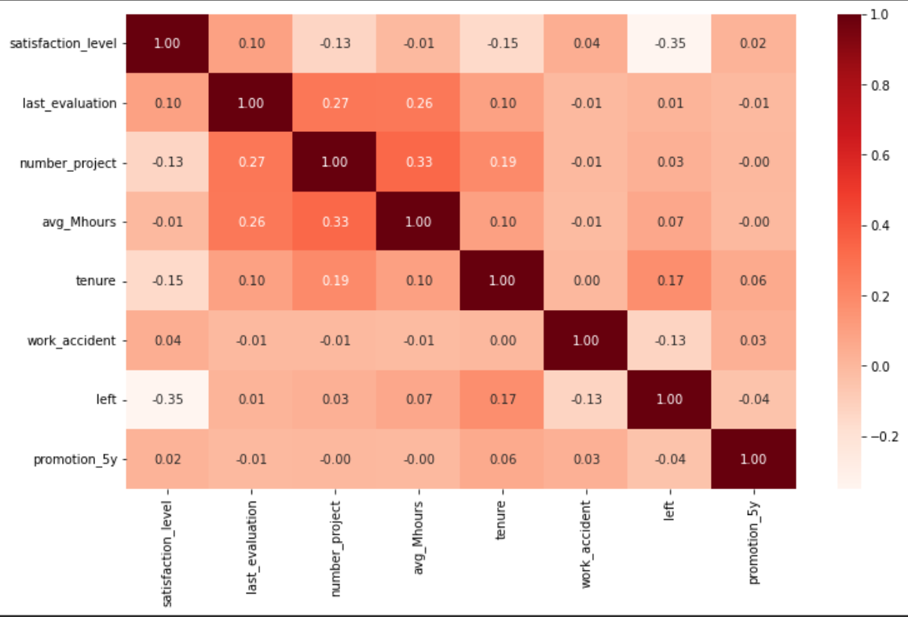
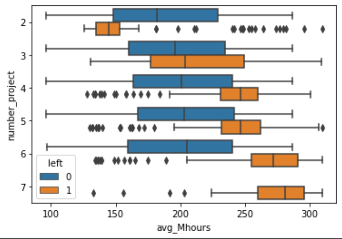
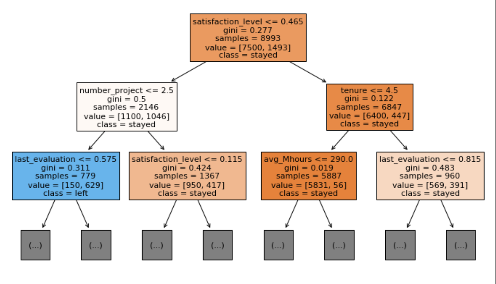

# Overview

The goal of this project is to predict whether an employee will leave the company (binary classification) and to identify the most important factors that drive employee turnover. The analysis uses an HR dataset (the classic employee-retention dataset) and compares tree-based models - in particular a Decision Tree, a Tuned Decision Tree, and an XGBoost classifier - to identify which employees are likely to leave and which features contribute most to that prediction.

The best-performing model in the notebook is XGBoost with ~98.30% accuracy and ~96.86% precision on the test set. The models and permutation-based feature importance show that employee satisfaction, number of projects employees worked on, last evaluation, average monthly hours and time spent in the company are the top predictors of whether an employee leaves.

Executive summary with the one-page summary of findings can be found in this repository.

## Business Understanding

Salifort Motors (project stakeholder) needs to improve employee retention. The business question is:
What makes an employee likely to leave the company?
Answering this lets HR and leadership take targeted actions (change workload, reward/recognition policies, career-path planning, etc.) to reduce unwanted attrition and its associated costs.
Key actionable business recommendations:

- Monitor and act on low self-reported satisfaction level signals (these are highly indicative of turnover).
- Limit or better manage the number of concurrent projects (number_project) assigned to employees.
- Re-examine how performance evaluations and hours worked relate to retention: ensure rewards and evaluations are fair and not biased toward overworked people.
- Use tenure/time-spent-in-company signals to determine retention risk and prioritize retention interventions.

## Data Understanding

Dataset used: HR_capstone_dataset.csv (loaded and explored in ADA_capstone.ipynb).
After cleaning and feature engineering the notebook works with 14,999 rows and 10 columns (features). The notebook includes data dictionary entries and basic EDA (head, info(), distributions, bar charts).

Main features (examples / description):
- satisfaction_level — employee self-reported satisfaction (0–1)
- last_evaluation — latest performance evaluation score (0–1)
- number_project — number of projects assigned
- average_monthly_hours (aka avg_Mhours) — average monthly hours worked
- time_spend_company (aka tenure) — years at company
- Work_accident, promotion_last_5years, department, salary (categorical), left (target)

A class-balance bar chart in the notebook / executive summary shows the distribution of left (left vs stayed). High-level variable summaries and actionable insights are summarized in the uploaded executive summary.

## Modeling and Evaluation

Models trained:

1) Baseline Decision Tree
2) Tuned Decision Tree (grid-search / tuned hyperparameters)
3) XGBoost classifier (with hyperparameter tuning)

Evaluation metrics reported (selected):
- Decision Tree: accuracy ≈ 97.16%, precision ≈ 91.38%, recall ≈ 91.57%, f1 ≈ 91.47%
- Tuned Decision Tree: accuracy ≈ 98.27%, precision ≈ 96.46%, recall ≈ 92.97%, f1 ≈ 94.68%
- XGBoost (final/tuned): accuracy ≈ 98.30%, precision ≈ 96.86%, recall ≈ 92.77%, f1 ≈ 94.77%
(Exact numbers, cross-validation details, confusion matrices and ROC curves are available in the notebook.)

### Feature importance
Permutation importance was used to compare how much each feature affects model performance when shuffled. Top features reported by the XGBoost-based permutation importance (top 5, descending) are:

- satisfaction_level — 0.5073 (permutation importance score)
- number_project — 0.2421
- tenure (time_spend_company) — 0.1335
- last_evaluation — 0.1166
- average_monthly_hours (avg_Mhours) — 0.1143

Decision Tree permutation importance shows a similar ordering with slightly different magnitudes.

### Notes on methodology

Standard preprocessing: categorical encoding (salary, department), missing-value handling (if any), features scaling where appropriate.
Evaluation used train/test split and cross-validated grid searches for hyperparameter tuning.
Permutation importance (inspecting how shuffling each feature affects performance) was used instead of raw split-based feature importances to get a model-agnostic measure of variable influence.

## Conclusion

This project produces a performant classifier XGBoost that both predicts employee attrition with high accuracy and yields explainable, business-actionable insights: the factors indicative of turnover turnover are employee satisfaction, workload (number of projects), tenure, evaluation scores, and monthly hours. Those insights can be translated into HR actions (e.g., surveying and addressing dissatisfaction, adjusting workloads, rethinking evaluation and reward schemes) to reduce attrition and its costs. Executive-level recommendations and next steps are summarized in the provided executive summary.

